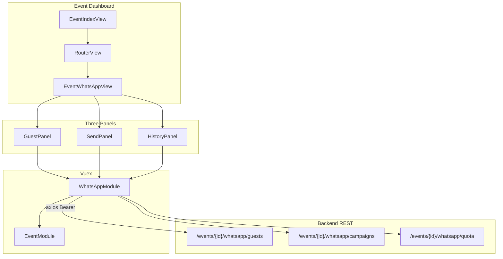

# Event WhatsApp Messaging Section

## Context

- **Repo scope:** Frontend-only ([`frontend/`](frontend/)). No WhatsApp or guest-contact code exists today.
- **Event context:** Owner dashboard reads `event.id` from Vuex via [`EventModule.ts`](frontend/src/store/modules/EventModule.ts) — same pattern as [`EventAssetsView.vue`](frontend/src/views/EventAssetsView.vue). No new route param needed.
- **Auth:** Global axios Bearer header in [`main.ts`](frontend/src/main.ts) + [`Auth.ts`](frontend/src/helpers/Auth.ts).
- **UI language:** Hebrew labels (consistent with existing event dashboard).
- **Default choices** (questions skipped): frontend-only with defined API contract; modal edit for guests.

## Architecture



## 1. Routing and navigation

**[`frontend/src/router/index.ts`](frontend/src/router/index.ts)** — add child route:

```ts
{ path: "whatsapp", name: "eventWhatsApp", component: () => import("../views/EventWhatsAppView.vue") }
```

**[`frontend/src/views/EventIndexView.vue`](frontend/src/views/EventIndexView.vue)** — add nav item:

```ts
{ text: "WhatsApp", path: "/event/whatsapp", isActive: false }
```

## 2. Types and enums

**[`frontend/src/helpers/interfaces.ts`](frontend/src/helpers/interfaces.ts)**

```ts
export interface IWhatsAppGuest {
  id: number;
  full_name: string;
  phone: string; // E.164 preferred, e.g. +972501234567
}

export interface IWhatsAppQuota {
  remaining_sends: number;
  max_sends: number; // 3
}

export interface IWhatsAppCampaign {
  id: number;
  message: string;
  status: WhatsAppCampaignStatusEnum;
  scheduled_at: string | null;
  sent_at: string | null;
  recipient_count: number;
  sent_count: number;
  failed_count: number;
  created_at: string;
}

export interface IWhatsAppRecipientStatus {
  guest_id: number;
  full_name: string;
  phone: string;
  status: "sent" | "failed" | "pending";
  error_message?: string | null;
}

export interface IWhatsAppModuleState {
  guests: IWhatsAppGuest[];
  quota: IWhatsAppQuota | null;
  campaigns: IWhatsAppCampaign[];
  campaignDetail: { campaign: IWhatsAppCampaign; recipients: IWhatsAppRecipientStatus[] } | null;
  loading: boolean;
}
```

**[`frontend/src/helpers/enums.ts`](frontend/src/helpers/enums.ts)** — add `WhatsAppCampaignStatusEnum` (`pending`, `scheduled`, `sending`, `sent`, `failed`, `cancelled`).

## 3. Proposed REST API contract (backend to implement)

All endpoints require `Authorization: Bearer {token}` and verify event ownership.

| Method | Path | Purpose |
|--------|------|---------|
| GET | `events/{eventId}/whatsapp/guests` | List guests |
| POST | `events/{eventId}/whatsapp/guests` | Create guest `{ full_name, phone }` |
| PUT | `events/{eventId}/whatsapp/guests/{guestId}` | Update guest |
| DELETE | `events/{eventId}/whatsapp/guests/{guestId}` | Delete guest |
| POST | `events/{eventId}/whatsapp/guests/import` | `multipart/form-data` field `file` (CSV) |
| GET | `events/{eventId}/whatsapp/guests/template` | CSV download (`full_name,phone`) |
| GET | `events/{eventId}/whatsapp/quota` | `{ remaining_sends, max_sends }` |
| POST | `events/{eventId}/whatsapp/campaigns` | Send/schedule `{ message, guest_ids[], scheduled_at? }` |
| GET | `events/{eventId}/whatsapp/campaigns` | Campaign history list |
| GET | `events/{eventId}/whatsapp/campaigns/{id}` | Detail + per-recipient delivery status |
| POST | `events/{eventId}/whatsapp/campaigns/{id}/cancel` | Cancel pending/scheduled send |

**Validation rules (backend):**
- `message` max 4096 chars
- `scheduled_at` must be future ISO UTC when provided
- Reject send when `remaining_sends === 0`
- CSV rows: required `full_name` + `phone`; skip/return errors for invalid rows

## 4. Vuex module

**New file:** [`frontend/src/store/modules/WhatsAppModule.ts`](frontend/src/store/modules/WhatsAppModule.ts)

Actions (each reads `rootState.event.event.id` internally, mirroring [`EventModule`](frontend/src/store/modules/EventModule.ts)):

- `fetchGuests`, `createGuest`, `updateGuest`, `deleteGuest`
- `importGuests` (FormData POST)
- `downloadTemplate` (blob GET → trigger browser download)
- `fetchQuota`
- `sendCampaign` (payload: message, guest_ids, optional scheduled_at via [`time.toUTC()`](frontend/src/helpers/time.ts))
- `fetchCampaigns`, `fetchCampaignDetail`, `cancelCampaign`

Register in [`frontend/src/store/index.ts`](frontend/src/store/index.ts).

Error/success toasts via `notify()` + [`errorsHandler.ts`](frontend/src/helpers/errorsHandler.ts) — same as [`ContactModule.ts`](frontend/src/store/modules/ContactModule.ts).

## 5. Page and components

**New view:** [`frontend/src/views/EventWhatsAppView.vue`](frontend/src/views/EventWhatsAppView.vue)

Single scrollable page with three white card panels (`bg--white brs--medium padding--large`), stacked vertically. On mount: parallel `fetchGuests`, `fetchQuota`, `fetchCampaigns`.

### Panel A — Guest list

**New:** [`frontend/src/components/event/whatsapp/WhatsAppGuestPanel.vue`](frontend/src/components/event/whatsapp/WhatsAppGuestPanel.vue)

| Column | Implementation |
|--------|----------------|
| Checkbox | `MainCheckbox`; header select-all |
| Full name | Text |
| Phone | Text (LTR) |
| Actions | `MainIcon` edit / delete |

- **Empty state:** centered message + "Add guest" CTA (pattern from blocked-empty in [`EventAssetsView.vue`](frontend/src/views/EventAssetsView.vue))
- **Add guest:** `BaseButton` opens modal
- **Edit/delete:** modal edit; delete with confirm (`window.confirm` or small confirm modal)
- **Import CSV:** hidden `<input type="file" accept=".csv">` + upload button; dispatches `importGuests`
- **Download template:** link/button → `downloadTemplate` action

**New:** [`frontend/src/components/event/whatsapp/WhatsAppGuestModal.vue`](frontend/src/components/event/whatsapp/WhatsAppGuestModal.vue)

- Props: `open`, `guest?` (null = add mode)
- Fields: `MainInput` for name + phone
- Client validation: non-empty name, phone regex (digits, optional `+` prefix, min 9 digits)
- Emits `@save`, `@cancel`

**New:** [`frontend/src/components/event/whatsapp/WhatsAppGuestTable.vue`](frontend/src/components/event/whatsapp/WhatsAppGuestTable.vue)

- Simple responsive `<table>` with scoped SCSS (no table lib exists in codebase)
- Mobile: horizontal scroll wrapper

### Panel B — Send message form

**New:** [`frontend/src/components/event/whatsapp/WhatsAppSendPanel.vue`](frontend/src/components/event/whatsapp/WhatsAppSendPanel.vue)

- **Quota banner** (always visible when quota loaded):
  > "נותרו לך {remaining_sends} מתוך 3 הודעות לאירוע זה"
  Style: info banner like `.blocked-warning` in EventAssetsView; turn warning color when `remaining_sends === 0`.

- **Message:** [`MainTextArea`](frontend/src/components/library/inputs/MainTextArea.vue) with `:maxLength="4096"` + live counter `{message.length}/4096`

- **Guest checklist:** scrollable list of all guests, each with `MainCheckbox`, **all checked by default** on load / after guest list refresh. Track `selectedGuestIds: Set<number>`.

- **Send mode toggle:** segmented control or two `MainCheckbox`-style options:
  - "שליחה מיידית" (default)
  - "תזמון שליחה" → show `VueDatePicker` (Hebrew locale, `:min-date="new Date()"`, format `dd/MM/yyyy HH:mm` — copy from [`EventDetailsForm.vue`](frontend/src/components/event/EventDetailsForm.vue))

- **Submit button:** `BaseButton` with `:disabled="!canSubmit"` where:

```ts
canSubmit =
  guests.length > 0 &&
  message.trim().length > 0 &&
  selectedGuestIds.size > 0 &&
  quota?.remaining_sends > 0 &&
  (sendMode === 'now' || (scheduledAt && scheduledAt > new Date()))
```

- On success: clear message, refresh quota + campaigns, re-check all guests.

### Panel C — Send history

**New:** [`frontend/src/components/event/whatsapp/WhatsAppHistoryPanel.vue`](frontend/src/components/event/whatsapp/WhatsAppHistoryPanel.vue)

Table columns: date (`time.convertToLocalTime`), message preview (truncate ~80 chars), recipients count, sent/failed counts, status badge.

- **Status badge:** reuse color-mapping approach from [`SubscriptionStatus.vue`](frontend/src/components/profile/SubscriptionStatus.vue)
- **Cancel:** visible when status is `pending` or `scheduled` → `cancelCampaign`
- **Detail view:** row click or "פרטים" button opens [`WhatsAppCampaignDetailModal.vue`](frontend/src/components/event/whatsapp/WhatsAppCampaignDetailModal.vue) showing full message + per-guest delivery table (`fetchCampaignDetail`)

## 6. Cross-panel state sync

- Guest panel selection checkboxes are **independent** from send-panel recipient checklist (send panel always defaults all guests checked; user unchecks individuals there).
- After guest add/edit/delete/import, re-fetch guests and reset send-panel checklist to all-checked.
- After successful send/cancel, re-fetch quota + campaigns.

## 7. File map (new files)

| File | Role |
|------|------|
| `views/EventWhatsAppView.vue` | Page shell, data loading |
| `components/event/whatsapp/WhatsAppGuestPanel.vue` | Panel A |
| `components/event/whatsapp/WhatsAppGuestTable.vue` | Guest table |
| `components/event/whatsapp/WhatsAppGuestModal.vue` | Add/edit modal |
| `components/event/whatsapp/WhatsAppSendPanel.vue` | Panel B |
| `components/event/whatsapp/WhatsAppHistoryPanel.vue` | Panel C |
| `components/event/whatsapp/WhatsAppCampaignDetailModal.vue` | Delivery detail |
| `store/modules/WhatsAppModule.ts` | API + state |

**Modified files:** `router/index.ts`, `EventIndexView.vue`, `store/index.ts`, `helpers/interfaces.ts`, `helpers/enums.ts`

## 8. Testing checklist

- Navigate to `/event/whatsapp` from sidebar; redirects home if no active event
- Guest CRUD + CSV import + template download
- Send form disabled states (no guests, empty message, 0 recipients, quota exhausted, past schedule date)
- Schedule vs send-now payloads (`scheduled_at` omitted vs UTC ISO)
- History list renders; cancel works on pending; detail modal shows per-guest status
- Mobile layout: tables scroll horizontally; panels stack cleanly

## Out of scope (this repo)

Backend Laravel implementation (models, migrations, WhatsApp provider integration, queue jobs, webhooks). The API contract above is the handoff spec for that work.
