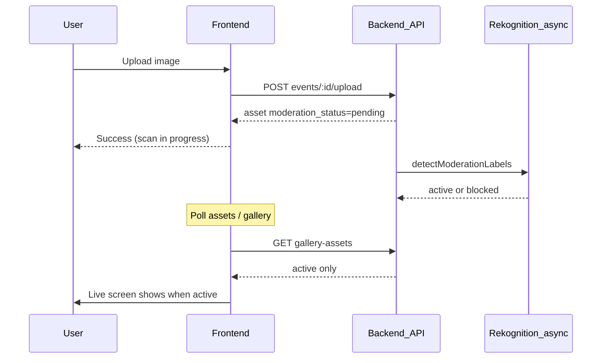

# Frontend: Content Moderation Status Integration

**Scope:** This repo (`LiveAlbums/frontend`) only. AWS Rekognition, `moderationService`, and `EventController.php` upload logic live in the **backend repo** (EC2). No AWS SDK install here.

**Agreed API field:** `moderation_status: 'pending' | 'active' | 'blocked'` on each asset in upload and list responses.

---

## Current state (relevant gaps)

- [`IEventAsset`](frontend/src/helpers/interfaces.ts) has only `is_displayed` (manual hide/show), no moderation field.
- Live galleries read [`getGalleryAssets`](frontend/src/store/modules/EventModule.ts) from `GET events/:id/gallery-assets` with **no client-side filter**.
- Owner file manager ([`EventAssetsView.vue`](frontend/src/views/EventAssetsView.vue)) shows **all** assets from `GET events/:id/assets` via `getAssets`.
- Upload commits [`ADD_FILE`](frontend/src/store/modules/EventModule.ts) immediately into `event.assets`; success UX implies instant visibility.
- **No WebSockets** in FE; live updates rely on HTTP polling (10s in `EventGallerySingle` / `EventGalleryZoom` only). `EventGalleryRandom`, `SplitScreen`, and grid layouts do **not** poll the gallery API today.



---

## Assumed backend contract (coordinate with BE repo)

| Endpoint | Expected behavior |
|----------|-------------------|
| `POST events/:id/upload` (and `auth/upload`) | Returns asset with `moderation_status: 'pending'` |
| `GET events/:id/gallery-assets` | **Only** `active` assets (and existing `is_displayed` rules) |
| `GET events/:path/base-assets` (guest) | **Only** `active` in `displayed_assets` |
| `GET events/:id/assets` (owner) | **All** statuses so admin can see pending/blocked |

If BE already filters gallery endpoints, FE still applies defensive filters (belt-and-suspenders).

---

## 1. Types and enums

**[`frontend/src/helpers/enums.ts`](frontend/src/helpers/enums.ts)**

Add (separate from event `StatusEnum`):

```ts
export enum AssetModerationStatusEnum {
  PENDING = 'pending',
  ACTIVE = 'active',
  BLOCKED = 'blocked',
}
```

**[`frontend/src/helpers/interfaces.ts`](frontend/src/helpers/interfaces.ts)**

Extend `IEventAsset`:

```ts
moderation_status: AssetModerationStatusEnum;
```

Optional: `moderation_labels?: string[]` if BE returns rejection reasons for the blocked warning UI.

---

## 2. Vuex: getters, mutations, upload

**[`frontend/src/store/modules/EventModule.ts`](frontend/src/store/modules/EventModule.ts)**

| Change | Purpose |
|--------|---------|
| `getActiveGalleryAssets` | `gallery.assets` filtered to `moderation_status === active` |
| `getOwnerVisibleAssets` | `active` + `pending` (default owner grid) |
| `getBlockedAssets` | `blocked` only |
| `hasBlockedAssets` | `blocked.length > 0` |
| `hasPendingAssets` | `pending.length > 0` |
| `UPDATE_ASSET` mutation | Merge status when polling refreshes a single asset (optional; full `SET_FILES` is enough) |
| `ADD_FILE` | Preserve `moderation_status` from upload response; default to `pending` if missing |
| `getTotalAssets` | Count only owner-visible assets (active + pending), or split counts for UI labels |

**`uploadFile`:** No change to request flow. After success, do **not** add pending assets to `gallery.assets` (gallery store is separate; today `ADD_FILE` only touches `event.assets` anyway).

**`getEventGalleryAssets`:** After `SET_GALLERY_FILES`, optionally filter in commit or via getter only (prefer getter so raw store stays aligned with API).

---

## 3. Defensive filtering in gallery components

Point all live gallery consumers at `getActiveGalleryAssets` instead of `getGalleryAssets`:

- [`EventGallerySingle.vue`](frontend/src/components/event/EventGallerySingle.vue)
- [`EventGalleryZoom.vue`](frontend/src/components/event/EventGalleryZoom.vue)
- [`EventGalleryRandom.vue`](frontend/src/components/event/EventGalleryRandom.vue)
- [`EventGallerySplitScreen.vue`](frontend/src/components/event/EventGallerySplitScreen.vue)
- [`EventGalleryGrid3X3.vue`](frontend/src/components/event/EventGalleryGrid3X3.vue)
- [`EventGalleryGrid3X3FullScreen.vue`](frontend/src/components/event/EventGalleryGrid3X3FullScreen.vue)

Guest views already use backend-filtered lists; add the same filter in computed props for safety:

- [`EventGuestGalleryView.vue`](frontend/src/views/EventGuestGalleryView.vue)
- [`EventGuestAlbumView.vue`](frontend/src/views/EventGuestAlbumView.vue)

---

## 4. Gallery polling gap (pending → active)

Moderation is async; approved images must appear on live layouts without reload.

| Location | Action |
|----------|--------|
| [`EventGalleryFullScreenView.vue`](frontend/src/views/EventGalleryFullScreenView.vue) | `created` + 10s `setInterval` → `getEventGalleryAssets`; clear on `beforeUnmount` |
| [`EventGalleryView.vue`](frontend/src/views/EventGalleryView.vue) | Same polling for owner preview |
| `EventGallerySingle` / `Zoom` | Keep existing 10s poll (avoid duplicate if parent also polls — **pick one layer**: either parent-only or child-only to prevent double requests) |

Recommendation: **centralize** 10s polling in `EventGalleryFullScreenView` + `EventGalleryView`, remove duplicate interval from `Single`/`Zoom` in the same PR to avoid 2x traffic.

---

## 5. Owner assets admin UI (blocked toggle + warnings)

**[`frontend/src/views/EventAssetsView.vue`](frontend/src/views/EventAssetsView.vue)**

- **Default grid:** `getOwnerVisibleAssets` (active + pending).
- **Blocked section (conditional):** Render only when `hasBlockedAssets`:
  - Warning banner (Hebrew): e.g. “תמונות אלו נחסמו אוטומטית בשל תוכן לא הולם ואינן מוצגות באלבום החי או בגלריית האורחים.”
  - Toggle: “הצג תמונות חסומות” (`showBlockedAssets` local state).
  - When on, render blocked assets below the main grid (separate heading).
- **Polling:** When `hasPendingAssets`, poll `getEventAssets` every 5–10s (mirror [`EventAssetsView`](frontend/src/views/EventAssetsView.vue) download-process polling pattern); stop when no pending remain; clear interval on unmount.
- **Counts:** Update header “X קבצים” to reflect visible sections (e.g. exclude blocked unless toggle on).

**[`frontend/src/components/event/EventAssetCard.vue`](frontend/src/components/event/EventAssetCard.vue)**

Status chips (distinct from `is_displayed` hide icon):

| `moderation_status` | Badge / styling |
|---------------------|-----------------|
| `pending` | “בבדיקה” (neutral/warning) |
| `blocked` | “חסום” (red) + optional tooltip with `moderation_labels` |
| `active` | No badge (or subtle “מאושר” only in blocked section context) |

Blocked cards: optional visual overlay (dim + icon) so they are unmistakable in admin view.

---

## 6. Upload UX (non-blocking, honest messaging)

**[`frontend/src/components/library/inputs/UploadMedia.vue`](frontend/src/components/library/inputs/UploadMedia.vue)** and **[`EventUploadsView.vue`](frontend/src/views/EventUploadsView.vue)**

After successful upload:

- Success copy: upload received; image is **being reviewed** and will appear on the live album once approved (Hebrew, match existing tone).
- Do **not** imply immediate live display.
- Optional: show per-file status in upload card if `moderation_status` is returned (`pending` checkmark vs “ממתין לאישור”).

No change to multipart upload URL or auth flags.

---

## 7. Bulk actions behavior

In [`EventAssetsView.vue`](frontend/src/views/EventAssetsView.vue) / asset management:

- **Exclude `blocked`** from select-all and bulk hide/delete/download unless blocked section is visible and user explicitly selects them (simplest: blocked assets not selectable for bulk actions; view-only in blocked section).
- **`pending`:** Allow delete; hide action can stay disabled until `active` (optional product call — default: allow delete only).

---

## 8. Files to touch (summary)

| File | Change |
|------|--------|
| `helpers/enums.ts` | `AssetModerationStatusEnum` |
| `helpers/interfaces.ts` | `moderation_status` on `IEventAsset` |
| `store/modules/EventModule.ts` | Getters, `ADD_FILE`, optional filter helper |
| `views/EventAssetsView.vue` | Blocked section, toggle, pending poll |
| `components/event/EventAssetCard.vue` | Status badges / blocked styling |
| `components/library/inputs/UploadMedia.vue` | Post-upload messaging |
| `views/EventUploadsView.vue` | Guest upload messaging |
| `components/event/EventGallery*.vue` (6) | Use `getActiveGalleryAssets` |
| `views/EventGuestGalleryView.vue`, `EventGuestAlbumView.vue` | Defensive filter |
| `views/EventGalleryView.vue`, `EventGalleryFullScreenView.vue` | Centralized gallery polling |

**Out of scope (this repo):** `@aws-sdk/client-rekognition`, `moderationService`, env AWS keys, Pusher/WebSocket wiring.

---

## 9. Testing checklist (manual)

1. Upload image → appears in owner assets as **pending**, not on live gallery / guest gallery.
2. After BE sets `active` → appears on live gallery within poll interval.
3. After BE sets `blocked` → never on live/guest; visible only when owner enables blocked toggle; blocked section hidden when event has zero blocked assets.
4. Guest upload page shows “under review” success, not “live now”.
5. Existing hide/show (`is_displayed`) still works for **active** assets.

---

## Coordination note for backend team

Share this FE contract: field name **`moderation_status`**, values **`pending` | `active` | `blocked`**, gallery endpoints return active-only, owner `/assets` returns all statuses for admin UI.
