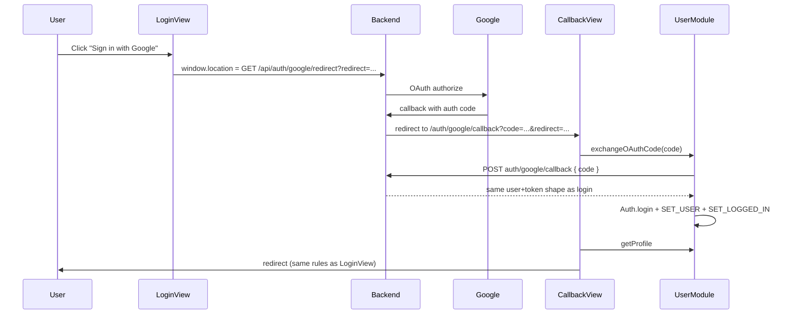

# Google SSO — Frontend Plan

## Current auth baseline

Auth today is email/password only via [`UserModule.ts`](frontend/src/store/modules/UserModule.ts):

- `POST auth/login` returns `{ data: { user: { ...fields, token, expired_at } } }`
- [`Auth.ts`](frontend/src/helpers/Auth.ts) stores the full user object (incl. token) in the `LiveAlbums` cookie and sets `axios` Bearer header
- [`App.vue`](frontend/src/App.vue) hydrates session on boot from cookie + `GET user/profile`
- Login redirect logic lives in [`LoginView.vue`](frontend/src/views/LoginView.vue) (`?redirect=`, subscription/event checks)

No OAuth exists. Backend lives in a separate repo (`VUE_APP_SERVER_BASE_URL`, e.g. `http://localhost:8000`).

## Chosen architecture (redirect flow)



**Why code exchange (not token in URL):** Backend redirects with a short-lived `code` query param; FE exchanges it via POST for the same login payload. Avoids exposing Bearer tokens in browser history/logs.

## Frontend changes

### 1. Google sign-in button component

Create [`frontend/src/components/auth/GoogleSignInButton.vue`](frontend/src/components/auth/GoogleSignInButton.vue):

- Styled secondary button matching existing auth pages (white bg, border, Google logo SVG inline—no new npm deps)
- Hebrew label: `המשך עם Google`
- Props: optional `redirect` string (post-login destination)
- On click: build backend redirect URL and navigate:

```ts
const params = new URLSearchParams();
params.set('redirect', `${process.env.VUE_APP_BASE_URL}/auth/google/callback`);
if (postLoginRedirect) params.set('post_login_redirect', postLoginRedirect);

window.location.href =
  `${process.env.VUE_APP_SERVER_BASE_URL}/api/auth/google/redirect?${params.toString()}`;
```

- `post_login_redirect` preserves existing `?redirect=/order` behavior through the OAuth round-trip (backend must echo it back on success—see BE prompt)

### 2. Login + Signup UI

Update [`LoginView.vue`](frontend/src/views/LoginView.vue) and [`SignupView.vue`](frontend/src/views/SignupView.vue):

- Add divider between email form and Google button (`— או —`)
- Place `GoogleSignInButton` below the primary submit button
- Pass `this.$route.query.redirect` to the button component

No changes to email/password validation or existing login/signup flows.

### 3. OAuth callback view

Create [`frontend/src/views/GoogleAuthCallbackView.vue`](frontend/src/views/GoogleAuthCallbackView.vue):

- Guest-only route (same as login)
- On `created`:
  - If `?error=` present → error notification, redirect to `/login`
  - If `?code=` missing → error notification, redirect to `/login`
  - Else dispatch `user/exchangeOAuthCode`, then `user/getProfile`
  - Apply same post-login redirect logic as `LoginView` (reuse via small shared helper—see below)
- Show loading state (`LoadingPage` pattern or inline spinner text in Hebrew)

### 4. Router

Add to [`frontend/src/router/index.ts`](frontend/src/router/index.ts):

```ts
{
  path: "/auth/google/callback",
  name: "googleAuthCallback",
  beforeEnter: Guard.guest,
  component: () => import("@/views/GoogleAuthCallbackView.vue"),
}
```

### 5. Vuex — reuse login session logic

Refactor [`UserModule.ts`](frontend/src/store/modules/UserModule.ts):

- Extract private helper `completeLogin(context, user)` from existing `login` action (cookie, strip token from Vuex state, commits, success notify)
- New action `exchangeOAuthCode(context, { code })`:
  - `POST auth/google/callback` with `{ code }`
  - On success: `completeLogin`, resolve user
  - On failure: error notification (Hebrew, same tone as login errors), resolve `null`

Add interface in [`interfaces.ts`](frontend/src/helpers/interfaces.ts):

```ts
export interface IGoogleOAuthExchangeRequest {
  code: string;
}
```

### 6. Shared post-login redirect helper

Create [`frontend/src/helpers/postLoginRedirect.ts`](frontend/src/helpers/postLoginRedirect.ts):

- Export `resolvePostLoginRoute(user, route, store): string`
- Encapsulates logic currently duplicated between LoginView and callback:
  - `route.query.redirect` (or `post_login_redirect` from OAuth callback query) takes priority
  - Else if user has subscription + event → `/event`
  - Else → `/`

Both `LoginView` and `GoogleAuthCallbackView` call this helper.

### 7. Env / config

No new required env vars for redirect flow—reuse:

- `VUE_APP_SERVER_BASE_URL` — OAuth start + code exchange API
- `VUE_APP_BASE_URL` — callback URL registered with backend/Google

Optionally document in [`.env.example`](frontend/.env.example) as comments for clarity.

## Files touched (summary)

| Action | File |
|--------|------|
| Create | `components/auth/GoogleSignInButton.vue` |
| Create | `views/GoogleAuthCallbackView.vue` |
| Create | `helpers/postLoginRedirect.ts` |
| Modify | `views/LoginView.vue` |
| Modify | `views/SignupView.vue` |
| Modify | `store/modules/UserModule.ts` |
| Modify | `helpers/interfaces.ts` |
| Modify | `router/index.ts` |

## Testing checklist (FE)

1. Login page: Google button redirects to backend (not 404)
2. Successful OAuth: lands on `/auth/google/callback`, user logged in, cookie set, profile loaded
3. `?redirect=/order` preserved through Google flow
4. OAuth error/cancel: friendly error, sent back to `/login`
5. Already logged-in user hitting callback route: guest guard redirects home
6. Signup page: same Google button works for new Google accounts (backend creates user)

---

## Backend prompt (for the other repo)

Copy/paste this to implement the server side:

---

**Task: Add Google SSO (OAuth 2.0 redirect flow) for LiveAlbums frontend**

### Context

- SPA frontend at `FRONTEND_URL` (local: `http://localhost:8008`, prod: `https://snapshare-live.com`)
- API base at `API_URL` (local: `http://localhost:8000/api`, prod: `https://server.snapshare-live.com/api`)
- Existing email/password login: `POST /api/auth/login` returns:

```json
{
  "data": {
    "user": {
      "id": 1,
      "first_name": "...",
      "last_name": "...",
      "email": "...",
      "role": "...",
      "order": { ... },
      "token": "<bearer_jwt>",
      "expired_at": "2026-..."
    }
  }
}
```

The frontend stores `user` (with token) in a cookie and uses `Authorization: Bearer {token}` for subsequent requests. **Google login must return the exact same response shape** so the FE can reuse `Auth.login()`.

Recommended: Laravel Socialite (`laravel/socialite`).

### Required endpoints

#### 1. `GET /api/auth/google/redirect`

Query params from FE:

- `redirect` — FE callback URL, e.g. `http://localhost:8008/auth/google/callback`
- `post_login_redirect` (optional) — original SPA path after login, e.g. `/order`

Behavior:

- Store `redirect` + `post_login_redirect` in OAuth `state` (encrypted/signed)
- Redirect user to Google consent screen
- Google OAuth redirect URI (registered in Google Cloud Console): `{API_HOST}/api/auth/google/callback` (adjust if your API routes differ)

#### 2. `GET /api/auth/google/callback` (Google hits this)

Behavior:

- Validate OAuth state
- Exchange Google code for user profile (email, given_name, family_name, google id)
- **User resolution:**
  - If user exists with matching `google_id` → log them in
  - Else if user exists with same email → link Google account to existing user (set `google_id`), then log in
  - Else create new user with Google profile data; **mark email as verified** (Google already verified)
- Issue same JWT/token as `auth/login` (same expiry logic)
- Redirect browser to FE:

```
{redirect}?code={one_time_code}&post_login_redirect={optional}
```

On failure/cancel:

```
{redirect}?error=access_denied
```

**Do NOT put the Bearer token in the redirect URL.** Use a short-lived (≈60s), single-use authorization code stored server-side (cache/DB).

#### 3. `POST /api/auth/google/callback`

Request body:

```json
{ "code": "<one_time_code_from_redirect>" }
```

Response: **identical to `POST auth/login` success** — `{ data: { user: { ..., token, expired_at } } }`

Errors: 400/401 with same error envelope as existing auth endpoints.

### Database changes

Add to `users` table (or equivalent):

- `google_id` — nullable, unique string
- `auth_provider` — enum/string: `email` | `google` (optional but useful)
- Ensure OAuth-only users can have `password = null`

### Business rules

- Google SSO users skip email confirmation flow
- Forgot-password for Google-only accounts: return friendly error ("Use Google sign-in")
- Logout (`POST user/logout`) works unchanged—invalidate token same as email login
- CORS: allow `FRONTEND_URL` if any cross-origin requests are needed (redirect flow mostly avoids CORS)

### Google Cloud Console setup

- Create OAuth 2.0 Client (Web application)
- Authorized redirect URI: `{API_HOST}/api/auth/google/callback`
- Authorized JavaScript origins: `FRONTEND_URL` (optional for redirect flow)
- Scopes: `openid`, `email`, `profile`

### Env vars (backend)

```
GOOGLE_CLIENT_ID=
GOOGLE_CLIENT_SECRET=
GOOGLE_REDIRECT_URI={API_HOST}/api/auth/google/callback
FRONTEND_URL=http://localhost:8008
```

### Security

- Sign/encrypt OAuth state; validate on callback
- One-time codes: expire quickly, delete after use
- Validate `redirect` param against allowlist (`FRONTEND_URL` only—prevent open redirect)
- Rate-limit code exchange endpoint

### Acceptance criteria

- New Google user can sign up via Google from FE signup/login page
- Existing email user with same Google email gets linked and logged in
- `POST auth/google/callback` response matches `POST auth/login` response
- FE callback at `/auth/google/callback?code=...` completes login end-to-end
- `post_login_redirect=/order` survives the full flow

---
