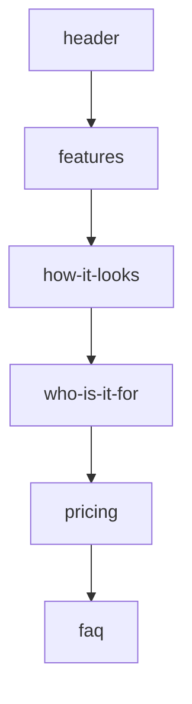

# Home Page Testimonials Section

## Goal

Insert a social-proof testimonials block **above** the pricing section in [`HomeView.vue`](frontend/src/views/HomeView.vue), between `<Clients />` and `<Pricing />`. Content: short Hebrew quotes from happy customers, matching the tone of existing marketing copy.

## Current page order



After change: `clients → testimonials → pricing → faq`

## New component

Create [`frontend/src/components/home/testimonials.vue`](frontend/src/components/home/testimonials.vue) following the same patterns as [`features.vue`](frontend/src/components/home/features.vue) and [`clients.vue`](frontend/src/components/home/clients.vue):

- **Section shell**: `home-page-section`, `id="testimonials"`, `width--page-size margin--auto`
- **Decorations**: scattered `MainCube` elements (pink + default), same visual language as pricing/FAQ
- **Title**: `h2.title--x-large` — **"מה אומרים עלינו"**
- **Optional subtitle**: one line bridging to pricing, e.g. "לקוחות שכבר חגגו איתנו"

### Card layout (3 testimonials, responsive)

| Desktop | Mobile |
|---------|--------|
| 3-column grid, centered | 1 column stack (or horizontal scroll if cards feel cramped) |

Each card reuses established glass styling:

- `background: #ffffff77`, `backdrop-filter: blur(20px)`, `border-radius: 16–20px`, soft shadow
- Large pink decorative quote mark (`"`) top-right
- 5-star row using `var(--pink)` / `#f68589`
- Quote body (2–3 lines, Hebrew)
- Footer: customer first name + event type badge (e.g. "דנה · חתונה", "יוסי · בר מצווה", "מיכל · אירוע חברה")

**Hover**: subtle `translateY(-4px)` + shadow deepen (same feel as gallery items in [`howItLooks.vue`](frontend/src/components/home/howItLooks.vue)).

**Background**: light section tint — e.g. soft pink wash `#f6858912` or a very subtle top-to-bottom gradient — so it visually separates the green-tinted "למי זה מתאים" section from the cube-heavy pricing block without clashing.

### Static data (no backend)

Store testimonials in a `data()` array (same approach as features/clients). Placeholder copy aligned with product value props (QR upload, live album, no app download). You can swap in real quotes later without structural changes.

## Wire into HomeView

In [`HomeView.vue`](frontend/src/views/HomeView.vue):

1. Import and register `Testimonials`
2. Insert `<Testimonials />` between `<Clients />` and `<Pricing />`
3. Add `"testimonials"` to `HOME_SECTION_IDS` **before** `"pricing"` so scroll-spy / hash navigation stays correct

```125:129:frontend/src/views/HomeView.vue
    <Clients />

    <Pricing />
```

becomes:

```vue
    <Clients />

    <Testimonials />

    <Pricing />
```

## Navigation updates (recommended)

Keep section discoverable from the top bar and mobile menu:

- [`DesktopBar.vue`](frontend/src/components/library/app/DesktopBar.vue): add **"המלצות"** → `/#testimonials` between "למי זה מתאים" and "המסלולים"
- [`AppMenu.vue`](frontend/src/components/library/app/AppMenu.vue): same link in `createBaseLinks()`
- [`Footer.vue`](frontend/src/components/library/app/Footer.vue) (optional): add link before "המסלולים שלנו"

## Side fix spotted nearby

[`pricing.vue`](frontend/src/components/home/pricing.vue) line 76 contains stray text `שדרגו` inside a `MainCube` prop — remove it while touching this area (likely accidental corruption).

## Visual reference (design tokens to reuse)

- Pink accent: `text--pink`, `color="pink"` on cubes, `#f68589cc` card footers (features)
- Typography: `title--x-large` headings, `font-weight: 700`
- Spacing: `min-height: calc(100vh - 99px)` on section, `width--two-thirds` / `max-width: 90%` content wrapper
- RTL: no LTR overrides needed; quote mark positioned with logical `inset-inline-start`

## Out of scope

- Backend/CMS for dynamic testimonials
- Carousel/auto-rotate (can be a follow-up if you want motion later)
- Real customer photos (initials-only avatars keep it simple and on-brand)

## Test plan

- Scroll home page: testimonials appear between "למי זה מתאים" and "המסלולים שלנו"
- Desktop + mobile (≤600px): cards stack/read cleanly, no overflow
- Click `/#testimonials` from nav: smooth scroll lands on section; desktop scroll-spy highlights it
- Hover states work on desktop; touch targets readable on mobile
