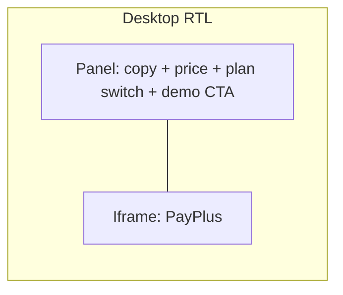

# Order page redesign (checkout + iframe)

## Current behavior

- [OrderView.vue](frontend/src/views/OrderView.vue): decorative background, pink “product” card with copy + plan buttons (`router-link` to `?subscription=`), and a white **סיכום הזמנה** column with price + **רכשו תוכנית** / **נסה עכשיו**.
- [SubscriptionPaymentView.vue](frontend/src/views/SubscriptionPaymentView.vue) (`/order/pay`): loads `paymentSrc` from `plan.payment_page_link` or `subscriptions/createCheckoutLink`, renders iframe.

## Target UX

- **Remove** the white summary block (`order-details` / סיכום הזמנה) entirely.
- **One checkout panel** (can sit inside or below the existing pink intro card): shows **current price** (e.g. `₪{{ currentPlan.price }}`), **plan switcher** (segmented control or pill row — not separate “summary” section), and **demo-only** `MainButton` for **נסה עכשיו**.
- **Paid plans (logged in):** no separate “רכשו תוכשית” step — the **iframe loads automatically** for the selected slug (same logic as `loadPaymentSrc` in SubscriptionPaymentView).
- **Paid plans (guest):** keep gating: show a short message + link to login with `redirect` back to `/order?subscription=…` (update redirect target from `/order/pay` to `/order` in [OrderView.vue](frontend/src/views/OrderView.vue) `submitCheckout` / login paths — and **remove** the need for `submitCheckout` once iframe is primary; replace with inline login prompt in the iframe column).
- **Layout:** CSS grid or flex wrapper, e.g. `order-layout` with `min-height` on the iframe column; **desktop:** two columns (side‑by‑side); **≤600px:** single column with **panel first, iframe beneath** (matches “beneath in mobile”).
- **Iframe refresh on plan change:** when slug changes: clear `paymentSrc`, then re-run `loadPaymentSrc()` (reuse the same sequence as [SubscriptionPaymentView.vue lines 115–147](frontend/src/views/SubscriptionPaymentView.vue)). Optionally add `:key="form.subscription"` on the `<iframe>` so the element remounts when the URL changes (defensive against cached iframe state).

## Code changes (by file)

1. **[OrderView.vue](frontend/src/views/OrderView.vue)**
  - Template: delete `order-details`; add a **checkout strip/card** with price + plan switcher; add second column with loading / error / iframe states (mirror strings and behavior from SubscriptionPaymentView).  
  - Script: add `paymentSrc`, `loading`, `loadError`, and `loadPaymentSrc()` (extract duplicated logic into a small shared helper **optional** — if skipped, duplicate the ~35 lines to avoid scope creep).  
  - Watchers: after `applyQuerySubscription()` / when `form.subscription` or `$route.query.subscription` changes, if `isLogged && !isDemo && currentPlan`, call `loadPaymentSrc()`. On `mounted`, same conditions after `fetchPlans`.  
  - Plan selection: prefer `**$router.replace({ query: { subscription: slug } })`** instead of nested `router-link` + `@click` so history stays clean and URL stays the source of truth.  
  - Styles: new scoped classes for the two-column layout, gap, iframe `min-height` / `border-radius` / shadow (reuse values from [SubscriptionPaymentView.vue lines 193–206](frontend/src/views/SubscriptionPaymentView.vue) for consistency). Tweak widths so content is ~90–96% max width on mobile and a sensible max-width on desktop (e.g. ~1100–1200px container).
2. **[SubscriptionPaymentView.vue](frontend/src/views/SubscriptionPaymentView.vue)**
  - Turn into a **thin redirect**: on mount (or `beforeMount`), `replace` to `/order` preserving `subscription` query (and handle demo / guest redirect to login exactly as today, or delegate guest handling entirely to OrderView — simplest is redirect first, then let OrderView’s existing guards handle login). This preserves bookmarks and [pricing.vue](frontend/src/components/home/pricing.vue) links until updated.
3. **[pricing.vue](frontend/src/components/home/pricing.vue)**
  - Replace `/order/pay?subscription=` with `/order?subscription=` for paid tiers so users land directly on the redesigned page (optional if redirect is always in place, but cleaner for analytics and one less navigation).
4. **Router (optional)**
  - No route removal required if `/order/pay` remains a redirect view.

## Edge cases to handle in implementation

- **Demo:** do not request checkout link; iframe hidden; only **נסה עכשיו** in the panel.  
- **Errors:** show Hebrew error + retry button (same as SubscriptionPaymentView).  
- **RTL:** keep flex/grid direction consistent with the rest of the app; visually verify panel vs iframe order on desktop and mobile.

## Out of scope (unless you want it)

- Removing or reducing `MainCube` / `MainLine` decorations (can be a quick follow-up if the page still feels busy).

