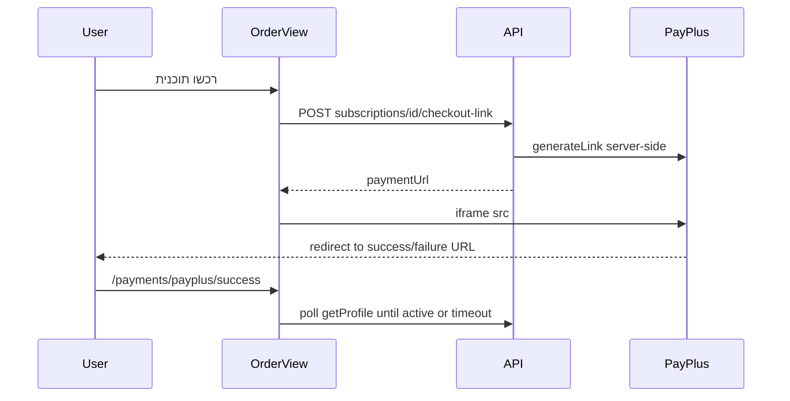

# PayPlus integration — frontend only

## Context

- [payplus_integration_cursor_guide.md](c:\xampp\htdocs\LiveAlbums\payplus_integration_cursor_guide.md) **Flow C / Phase 4** is the FE scope: real purchase CTA, fetch link, iframe, post-redirect UX with polling. Webhooks, `generateLink`, secrets, and invoice fetch stay in the other repo.
- Today, [OrderView.vue](c:\xampp\htdocs\LiveAlbums\frontend\src\views\OrderView.vue) already renders an iframe when `orderResponse.payment_page_link` is set, but paid plans use a readonly **"רכישה בקרוב"** button and the real `submit()` call is commented out. [StoreModule.ts](c:\xampp\htdocs\LiveAlbums\frontend\src\store\modules\StoreModule.ts) posts to `store/order` and only [OrderView.vue](c:\xampp\htdocs\LiveAlbums\frontend\src\views\OrderView.vue) uses it (demo still uses `store/demo`).
- Axios base URL is `VUE_APP_SERVER_BASE_URL + "/api/"` in [main.ts](c:\xampp\htdocs\LiveAlbums\frontend\src\main.ts), so FE paths are relative to `api/` (e.g. `subscriptions`, not `/api/subscriptions`).

## API contract (align with backend repo)

You chose the **guide-style** checkout API. The FE should assume:

- `**GET subscriptions`** — list plans (paid + demo if applicable). Each plan needs at least: **numeric `id`**, display **name/price**, and a **stable key** to match `?subscription=` from the router (e.g. `slug`, `code`, or `value` — **confirm field name with BE** when implementing).
- `**POST subscriptions/:id/checkout-link`** — returns checkout payload, minimally `**paymentUrl**` (iframe `src`). Optional: `expiresAt`, `providerRequestUid`, `provider` (guide suggests these).

If BE returns camelCase JSON, map once in the store action so views stay simple.

**Redirect URLs:** BE must set PayPlus `refURL_success` / `refURL_failure` so the user ends up on the SPA (directly or via a short BE 302). Those targets should land on the new routes below (or equivalent query on `/order`).

## Implementation steps

### 1. Types

In [interfaces.ts](c:\xampp\htdocs\LiveAlbums\frontend\src\helpers\interfaces.ts) (or a small `checkout.types.ts` if you prefer):

- `**ISubscriptionPlan**` — `id`, pricing/display fields, and the route-matching key (e.g. `slug: 'classic' | 'premium' | 'demo'`).
- `**ICheckoutLinkResponse**` — `paymentUrl`, optional `expiresAt`, `providerRequestUid`, `provider`.

Deprecate or narrow `**IOrderResponse**`: either remove `payment_page_link` in favor of `paymentUrl`, or keep a thin view-model that sets `payment_page_link` from `paymentUrl` for minimal template churn.

### 2. Vuex: subscriptions + checkout

Add a **namespaced module** (e.g. `subscriptions`) registered in [store/index.ts](c:\xampp\htdocs\LiveAlbums\frontend\src\store\index.ts):

- `**fetchPlans`** — `GET subscriptions`, store in module state, handle errors with existing [ErrorsHandler](c:\xampp\htdocs\LiveAlbums\frontend\src\helpers\errorsHandler) + `notify` pattern (match [StoreModule.ts](c:\xampp\htdocs\LiveAlbums\frontend\src\store\modules\StoreModule.ts)).
- `**createCheckoutLink(subscriptionId)**` — `POST subscriptions/${subscriptionId}/checkout-link`, resolve normalized checkout DTO.

Remove `**store/order**` from [StoreModule.ts](c:\xampp\htdocs\LiveAlbums\frontend\src\store\modules\StoreModule.ts) once [OrderView.vue](c:\xampp\htdocs\LiveAlbums\frontend\src\views\OrderView.vue) no longer dispatches it. Keep `**orderDemo**` unchanged.

### 3. Order page UX ([OrderView.vue](c:\xampp\htdocs\LiveAlbums\frontend\src\views\OrderView.vue))

- **Load plans from API** on mount (or `created`): replace or merge the hardcoded `subscriptions` array so prices/names stay in sync with BE.
- **Match `this.$route.query.subscription`** to the plan key from API (fallback if BE omits demo from list: keep local demo row or handle empty).
- **Paid plans:** replace readonly **"רכישה בקרוב"** and the contact-only funnel with an actionable button (**"רכשו תוכנית"** per guide, or keep Hebrew tone consistent with the app).
- **Flow:** same as existing `submit()` guard — if not logged in, `push('/login?redirect=/order?subscription=...')`. Then set loading, call `createCheckoutLink(selectedPlan.id)`, assign response, show iframe.
- **States:** `idle` / `loading` / `iframe` / optional `error` (failed link generation) with a retry path.
- **Iframe:** use the normalized URL; add **explicit sizing** (min-height/width) in scoped CSS so the payment page is usable on desktop and mobile. Avoid an overly strict `sandbox` unless PayPlus docs require it — payment pages often need forms/scripts.

### 4. Success / failure routes (browser redirect UX only)

Add routes in [router/index.ts](c:\xampp\htdocs\LiveAlbums\frontend\src\router\index.ts), e.g.:

- `/payments/payplus/success`
- `/payments/payplus/failure`

Implement as small views or one view with a `result` param. Behavior:

- Show clear Hebrew success/failure copy.
- **Poll** `user/getProfile` (or equivalent) on an interval with a **max duration**; if subscription becomes active (reuse logic similar to existing `userSubscriptionName` watcher — redirect to `/event`), stop polling.
- On timeout: message that confirmation may be delayed; link to `/profile` or `/order`.

**Important (guide):** do not treat this as proof of payment; copy can say that the account updates shortly after the provider confirms.

### 5. Home pricing section ([pricing.vue](c:\xampp\htdocs\LiveAlbums\frontend\src\components\home\pricing.vue))

Already deep-links to `/order?subscription=…`. Optional: rename buttons to **"רכשו תוכנית"** for paid tiers only if you want parity with the guide; not strictly required if the order page carries the main CTA.

### 6. Environment / hygiene

- No PayPlus secrets in the FE; only `VUE_APP_SERVER_BASE_URL` (already used).
- [frontend/payplus notes.txt](c:\xampp\htdocs\LiveAlbums\frontend\payplus notes.txt) contains API-like strings — **do not commit real keys**; rotate if they were ever real and prefer env on the backend only.

### 7. Verification

- Manual: logged-in user, classic/premium, iframe loads, after test payment redirect hits new route, polling behavior, redirect to event when profile shows subscription.
- Adjust typings if BE uses different JSON keys; add a single normalization layer in the store.

## Out of scope (other repo)

- `generateLink`, IPN, hash verification, DB, invoice `GetDocuments`, merchant email, env vars from guide §14.

